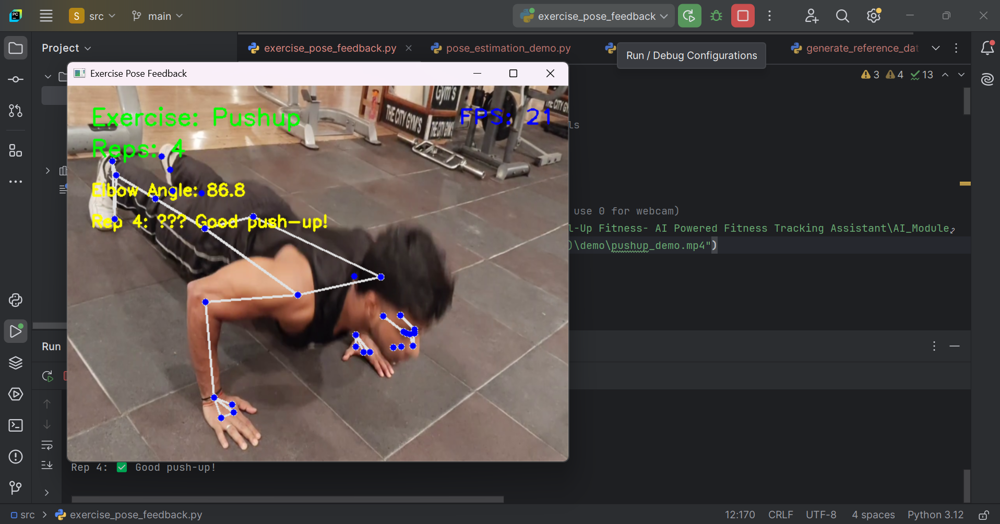
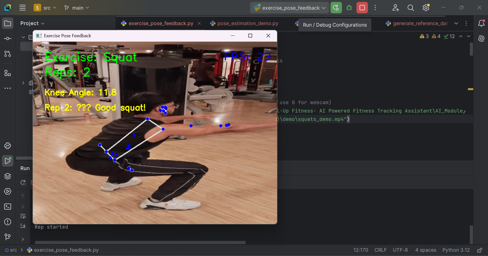

# 💪 Level-Up Fitness – AI-Based Fitness Coaching Web Application

Level-Up Fitness is a **full-stack AI-powered fitness coaching platform** designed to help users improve exercise form, track workouts, and receive personalized fitness guidance.

The system integrates **computer vision, web technologies, and backend services** to deliver an intelligent fitness training experience.

This project was developed as a **capstone project combining Artificial Intelligence and Full-Stack Web Development**.

---

# 🧠 System Overview

The platform consists of three major modules:

1️⃣ **AI Module** – Computer vision based posture detection and exercise analysis
(Standalone repository: https://github.com/skynet-007-ai/level-up-fitness-ai-pose-estimation-module)

2️⃣ **Backend Module** – User authentication, workout management, and API services
3️⃣ **Frontend Module** – Interactive user interface for workouts, yoga, meditation, and diet plans

The system enables users to:

• Analyze exercise posture using AI
• Track workout performance
• Access guided workouts, yoga, and meditation
• Receive diet plan recommendations

---

# 🏗️ Project Architecture

```
User
  │
  ▼
Frontend (HTML, CSS, JavaScript)
  │
  ▼
Backend (Node.js, Express.js)
  │
  ├── MongoDB Atlas (User Data)
  │
  └── AI Module (Python, MediaPipe, OpenCV)
           │
           ▼
     Pose Estimation & Feedback
```

---

# 📂 Repository Structure

```
Level-Up-Fitness-Webapp-AI-Based-Fitness-Coaching-Assistant
│
├── AI_Module
│   ├── src
│   ├── demo
│   ├── dataset_sample
│   ├── reference_data
│   └── requirements.txt
│
├── Backend_Module
│   ├── config
│   ├── middleware
│   ├── models
│   ├── routes
│   ├── public
│   ├── server.js
│   └── package.json
│
├── Frontend_Module
│   ├── landingpage
│   ├── About
│   ├── ContactUs
│   ├── Profile
│   ├── TODOList
│   ├── Webpage1
│   ├── Webpage2Med
│   └── Webpage2Yoga
│
├── README.md
├── LICENSE
└── .gitignore
```

---

# ✨ Key Features

### 🤖 AI-Based Exercise Form Detection

• Real-time pose estimation using **MediaPipe**
• Detects **Push-ups and Squats**
• Provides posture feedback
• Counts exercise repetitions automatically

### 👤 User Authentication System

• Secure login and registration using **JWT**
• User data stored in **MongoDB Atlas**

### 🏋️ Workout Training Pages

• Bodyweight exercise guidance
• Exercise demonstration media
• Training workflow interface

### 🧘 Yoga and Meditation Sections

• Guided yoga pages
• Meditation resources for mental wellness

### 🥗 Diet Plan Integration

• Calorie-based diet plans
• Downloadable PDF meal plans

### 📝 Productivity Tools

• Built-in **To-Do list** for tracking daily fitness goals

---

## 📸 Demo

### Push-up Detection


### Squat Detection


---

# 🛠️ Tech Stack

| Component            | Technology            |
| -------------------- | --------------------- |
| Frontend             | HTML, CSS, JavaScript |
| Backend              | Node.js, Express.js   |
| Database             | MongoDB Atlas         |
| Authentication       | JSON Web Tokens (JWT) |
| AI Module            | Python                |
| Pose Estimation      | MediaPipe             |
| Computer Vision      | OpenCV                |
| Numerical Processing | NumPy                 |

---

# ⚙️ Installation and Setup

### 1️⃣ Clone the repository

```
git clone https://github.com/skynet-007-ai/Level-Up-Fitness-Webapp-AI-Based-Fitness-Coaching-Assistant.git
cd Level-Up-Fitness-Webapp-AI-Based-Fitness-Coaching-Assistant
```

---

### 2️⃣ Setup Backend

```
cd Backend_Module
npm install
node server.js
```

---

### 3️⃣ Run AI Module

```
cd AI_Module
pip install -r requirements.txt
python src/exercise_pose_feedback.py
```

---

### 4️⃣ Run Frontend

Open the HTML files inside:

```
Frontend_Module/landingpage
```

in your browser.

---

# 🚀 Future Improvements

• Support more exercises (lunges, planks, pull-ups)
• Integrate AI module directly into the web interface
• Add real-time voice feedback for posture correction
• Implement workout progress analytics dashboard
• Deploy the system as a cloud-based fitness assistant

---

# 👨‍💻 Team Members

### Harsh Kumar (24A12RES271) – AI/ML Lead & Project Coordinator
GitHub: https://github.com/skynet-007-ai

• Designed AI-based posture detection system
• Implemented MediaPipe + OpenCV pose estimation
• Integrated AI module with web application architecture

### Hanshraj Kumar (24A12RES260) – Frontend Developer

• Developed UI using HTML, CSS, JavaScript
• Designed workout and yoga interface

### Harsh Kumar (24A12RES268) – Backend Developer

• Built backend using Node.js and Express.js
• Implemented authentication with JWT
• Managed MongoDB database and API routes

---

# 📌 Project Status

This project was developed as part of the **Level-Up Fitness Capstone Project**.

It demonstrates how **Artificial Intelligence, Computer Vision, and Full-Stack Web Development** can be combined to build an intelligent fitness coaching platform.

---

# 📜 License

This project is licensed under the **MIT License**.
